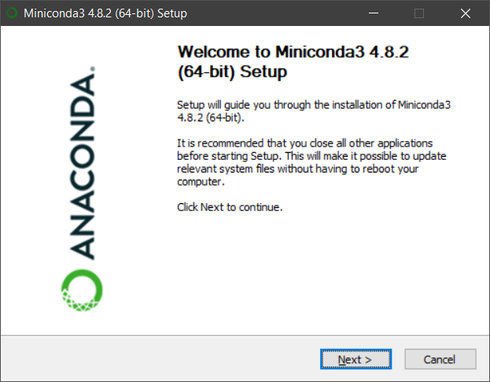
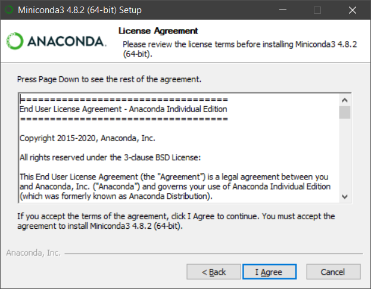
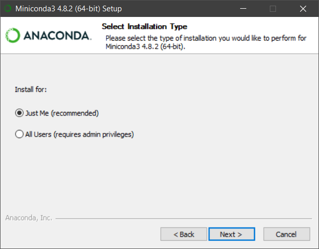
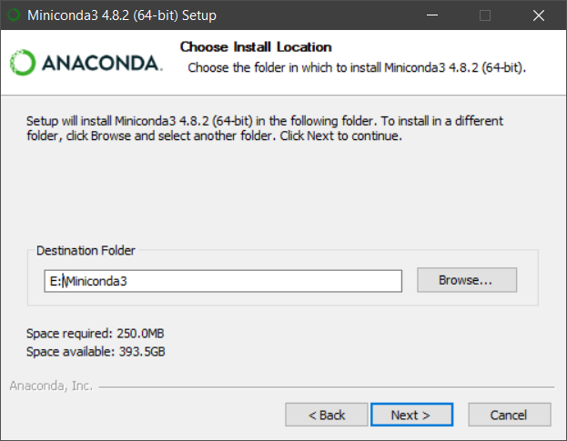
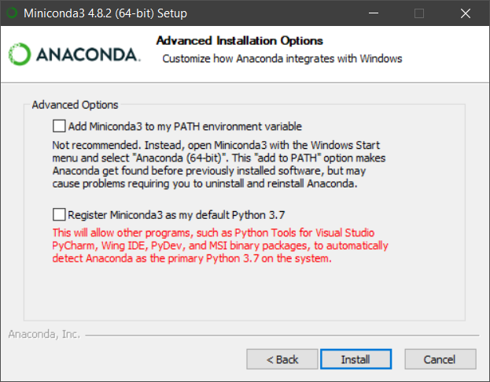
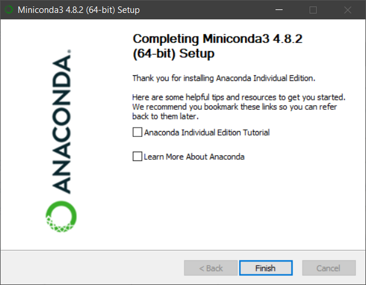
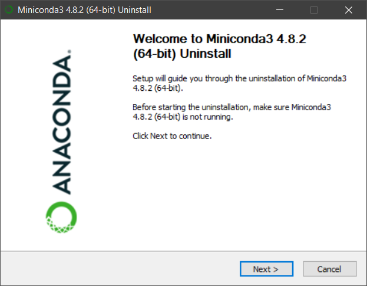
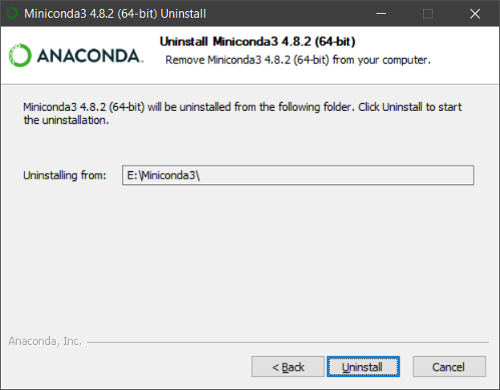

# Getting started with FMPy on Windows

This guide is intended for beginners with no experience with Python and provides step-by-step instructions to install FMPy on Windows.
This method...

- takes about 10 min (depending on the internet connection)
- does not require admin privileges
- does not add entries to the registry or environment variables
- can easily be removed by running the uninstaller

## Installation

1. Download and run the [Miniconda Installer](https://repo.anaconda.com/miniconda/Miniconda3-latest-Windows-x86_64.exe)

2. Click `Next`



3. Click `I Agree`



4. Select `Just Me (recommended)` and click `Next`.



5. Select a local folder (no network drive) where you have write access.
Make sure the path start with a drive letter (e.g. `E:\`) and contains no spaces.
Click `Next`.



6. Uncheck both options and click `Install`.



7. Uncheck both options and click `Finish`.



8. Open `Start Menu > Anaconda Prompt (Miniconda3)` and run the command `conda install -y -c conda-forge fmpy`.

```
(base) C:\>conda install -y -c conda-forge fmpy
Collecting package metadata (current_repodata.json): done
Solving environment: done

...

Downloading and Extracting Packages

...

Preparing transaction: done
Verifying transaction: done
Executing transaction: done
```

FMPy is now installed. To use it, open `Start Menu > Anaconda Prompt (Miniconda3)` that sets the necessary environment variables. From the Ananconda Prompt you can now

- [Start the Graphical User Interface](README.md#start-the-graphical-user-interface)
- [Simulate an FMU on the command line](README.md#simulate-an-fmu-on-the-command-line)
- [Simulate an FMU in Python](README.md#simulate-an-fmu-in-python)

## Uninstallation

1. Open the `Start` menu and select `Control Panel > Programs and Features`.

2. Select `Miniconda3` and click `Uninstall` and follow the instructions.

3. Click `Next`.



4. Click `Uninstall`.


